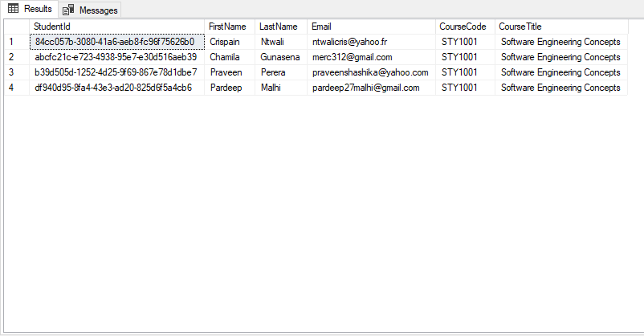

# Student Blazor App for STY1001

## What you need

- Latest .NET version
- Visual Studio Code (or any editor)
- SQL Server Express LocalDB (Download SQL Server Express 2019, do a basic installation)
  > https://docs.microsoft.com/en-us/sql/database-engine/configure-windows/sql-server-express-localdb?view=sql-server-ver15
- Install Entity Framework CLI using your terminal
  > dotnet tool install --global dotnet-ef

---

## Instructions

1. Open a terminal window, go to the directory you wish to create the project in, and create a Blazor server app by typing

> dotnet new blazorserver -o StudentBlazorTF

2. Enter the folder, and ensure that the app template is functional (visit localhost:5000 on your browser).

> cd StudentBlazorTF

> dotnet run

4. Run these commands in your terminal while in the root of your project.

> dotnet add package Microsoft.EntityFrameworkCore.Design

> dotnet add package Microsoft.EntityFrameworkCore.SqlServer

> dotnet add package Microsoft.EntityFrameworkCore.SqlServer.Design

3. Open the newly created folder in your code editor.

4. Create a folder called Models inside the Data folder. Create a file Student.cs inside Models (this is our data model). Enter the following code.

```
using System.ComponentModel.DataAnnotations;

namespace ServerBlazorEF.Models {
  // This is the C# class that models the data structure that we are going to create.
  // We have a variable for each field in the database.
  public class Student {
    public string StudentId { get; set; }
    [Required]
    public string FirstName { get; set; }
    [Required]
    public string LastName { get; set; }
    [Required]
    public string Email { get; set; }
    [Required]
    public string CourseCode { get; set; }
    [Required]
    public string CourseTitle { get; set; }
  }
}
```

5. Open appsettings.json and enter the following code to the json object.

```
"ConnectionStrings": {
  "DefaultConnection": "Server=(localdb)\\mssqllocaldb;Database=CollegeDB;Trusted_Connection=True;MultipleActiveResultSets=true"
},
```

6. In the Data folder, create a file SchoolDbContext.cs.

```
using System;
using Microsoft.EntityFrameworkCore;

namespace ServerBlazorEF.Models {
    // This code, using EntityFrameworkCore and the model we created (Student.cs) will create the database schema.
    // We populate the database with 4 initial entries, one for each group member.
  public class SchoolDbContext : DbContext {
    public DbSet<Student> Students { get; set; }

    public SchoolDbContext(DbContextOptions<SchoolDbContext> options) : base(options) { }

    protected override void OnModelCreating(ModelBuilder builder) {
      base.OnModelCreating(builder);

      builder.Entity<Student>().HasData(
        new {
          StudentId = Guid.NewGuid().ToString(),
          FirstName = "Chamila",
          LastName = "Gunasena",
          Email = "merc312@gmail.com",
          CourseCode = "STY1001",
          CourseTitle = "Software Engineering Concepts"
        },
        new {
          StudentId = Guid.NewGuid().ToString(),
          FirstName = "Pardeep",
          LastName = "Malhi",
          Email = "pardeep27malhi@gmail.com",
          CourseCode = "STY1001",
          CourseTitle = "Software Engineering Concepts"
        },
        new {
          StudentId = Guid.NewGuid().ToString(),
          FirstName = "Crispain",
          LastName = "Ntwali",
          Email = "ntwalicris@yahoo.fr",
          CourseCode = "STY1001",
          CourseTitle = "Software Engineering Concepts"
        },
        new {
          StudentId = Guid.NewGuid().ToString(),
          FirstName = "Praveen",
          LastName = "Perera",
          Email = "praveenshashika@yahoo.com",
          CourseCode = "STY1001",
          CourseTitle = "Software Engineering Concepts"
        }
      );
    }
  }
}

```

7. Open the Startup.cs file, import the following namespaces (insert alongisde the rest of the using directives).

```
using ServerBlazorEF.Models;
using Microsoft.EntityFrameworkCore;
```

8. In the Startup.cs file, add the following code to the function ConfigureServices()

```
// Creates the database connection on startup
services.AddDbContext<SchoolDbContext>(
    option => option.UseSqlServer(Configuration.GetConnectionString("DefaultConnection")));
```

9. Enter the root directory of your project with a terminal. And execute the following command

> dotnet-ef migrations add initial_migration

If executed correctly there should be a new folder in your root called Migrations.

10. Next, create the database by running this command in your terminal.

> dotnet-ef database update

11. Create a file StudentService.cs in the Data folder.

```
using System.Collections.Generic;
using System.Linq;
using System.Threading.Tasks;
using Microsoft.EntityFrameworkCore;

namespace ServerBlazorEF.Models {
  // This class contains CRUD operations to interface with the SQL database.
  // We have Get (Read), Insert (Create), Update, and Delete methods in this function.
  // These methods are asynchronous as performing operations on database is not instantaneous.
  public class StudentService {
      SchoolDbContext _context;
      public StudentService(SchoolDbContext context) {
        _context = context;
      }

      public async Task<List<Student>> GetStudentsAsync() {
        return await _context.Students.ToListAsync();
      }

      public async Task<Student> GetStudentByIdAsync(string id) {
        return await _context.Students.FindAsync(id);
      }

      public async Task<Student> InsertStudentAsync(Student student) {
        _context.Students.Add(student);
        await _context.SaveChangesAsync();

        return student;
      }

      public async Task<Student> UpdateStudentAsync(string id, Student s) {
        var student = await _context.Students.FindAsync(id);

        if (student == null)
          return null;

        student.FirstName = s.FirstName;
        student.LastName = s.LastName;
        student.Email = s.Email;
        student.CourseCode = s.CourseCode;
        student.CourseTitle = s.CourseTitle;

        _context.Students.Update(student);
        await _context.SaveChangesAsync();

        return student;
      }

      public async Task<Student> DeleteStudentAsync(string id) {
        var student = await _context.Students.FindAsync(id);

        if (student == null)
          return null;

        _context.Students.Remove(student);
        await _context.SaveChangesAsync();

        return student;
      }

      private bool StudentExists(string id) {
        return _context.Students.Any(e => e.StudentId == id);
      }
  }
}

```

12. Add the following to the ConfigureServices() method in the Startup.cs file.

```
// Loads the StudentService class we wrote into the BlazorApp
services.AddScoped<StudentService>();
```

13. In the Pages folder, create a new file Students.razor

```
@page "/students"
@using ServerBlazorEF.Models
@inject StudentService studentService

<h1>Students</h1>

<p>This component demonstrates managing students data.</p>

@* While the database is loading, show loading text. Once it is loaded,
   display the database entries in an html table. *@
@if (students == null) {
  <p><em>Loading...</em></p>
} else {
  <button @onclick="Add"  class="btn btn-success">Add</button>
  <table class='table table-hover'>
    <thead>
      <tr>
        <th>ID</th>
        <th>First Name</th>
        <th>Last Name</th>
        <th>Email</th>
        <th>Course Code</th>
        <th>Course Title</th>
      </tr>
    </thead>
    <tbody>
      @* Iterate over the students list (a type of C# container) using the foreach method.
         This creates one row in the table for each entry. *@
      @foreach (var item in students) {
        <tr @onclick="(() => Show(item.StudentId))">
          <td>@item.StudentId</td>
          <td>@item.FirstName</td>
          <td>@item.LastName</td>
          <td>@item.Email</td>
          <td>@item.CourseCode</td>
          <td>@item.CourseTitle</td>
        </tr>
      }
    </tbody>
  </table>
}

@* If the database is loaded and the add button has been pressed (add mode),
   shows an input form for a new entry. *@
@if (students != null && mode==MODE.Add) // Insert form
{
  <input placeholder="First Name" @bind="@firstName" /><br />
  <input placeholder="Last Name" @bind="@lastName" /><br />
  <input placeholder="Email" @bind="@email" /><br />
  <input placeholder="Course Code" @bind="@courseCode" /><br />
  <input placeholder="Course Title" @bind="@courseTitle" /><br />
  <button @onclick="Insert" class="btn btn-warning">Insert</button>
}

@* If the database is loaded and an entry has been selected,
   shows an input form with the data from the selected entry prefilled. *@
@if (students != null && mode==MODE.EditDelete) // Update & Delete form
{
  <input type="hidden" @bind="@studentId" /><br />
  <input placeholder="First Name" @bind="@firstName" /><br />
  <input placeholder="Last Name" @bind="@lastName" /><br />
  <input placeholder="Email" @bind="@email" /><br />
  <input placeholder="Course Code" @bind="@courseCode" /><br />
  <input placeholder="Course Title" @bind="@courseTitle" /><br />
  <button @onclick="Update" class="btn btn-primary">Update</button>
  <span>&nbsp;&nbsp;&nbsp;&nbsp;</span>
  <button @onclick="Delete" class="btn btn-danger">Delete</button>
}

@* The methods and the variables used in the UI. These interface with our database model. *@
@functions {
  @* Container for all student entries. *@
  List<Student> students;
  string studentId;
  string firstName;
  string lastName;
  string email;
  string courseCode;
  string courseTitle;

  @* Enumerator that represents a mode for the page (either None, Add or Edit/Delete)  *@
  private enum MODE { None, Add, EditDelete };
  MODE mode = MODE.None;
  Student student;

  @* Calls the load method when the page loads *@
  protected override async Task OnInitializedAsync() {
    await load();
  }

  @* Gets the list of students from the database (uses StudentService) *@
  protected async Task load() {
    students = await studentService.GetStudentsAsync();
  }

  @* CRUD operations from the UI. Executed when the insert button is clicked. *@
  protected async Task Insert() {
    Student s = new Student() {
      StudentId = Guid.NewGuid().ToString(),
      FirstName = firstName,
      LastName = lastName,
      Email = email,
      CourseCode = courseCode,
      CourseTitle = courseTitle
    };

    await studentService.InsertStudentAsync(s);
    ClearFields();
    await load();

    @* After insertion, resets the mode to None *@
    mode = MODE.None;
  }

  @* Simple method to clear the input form fields. *@
  protected void ClearFields() {
    studentId = string.Empty;
    firstName = string.Empty;
    lastName = string.Empty;
    email = string.Empty;
    courseCode = string.Empty;
    courseTitle = string.Empty;
  }

  @* Executed when the user clicks on the Add button. *@
  protected void Add() {
    ClearFields();
    @* Sets the mode to Add *@
    mode = MODE.Add;
  }

  @* Executed when an entry is updated (edited) *@
  protected async Task Update() {
    @* Creates a new student object with the input data. *@
    Student s = new Student() {
      StudentId = studentId,
      FirstName = firstName,
      LastName = lastName,
      Email = email,
      CourseCode = courseCode,
      CourseTitle = courseTitle
    };

    @* Replaces the entry with the same id with the updated info *@
    await studentService.UpdateStudentAsync(studentId, s);
    ClearFields();
    await load();
    mode = MODE.None;
  }

  @* Executed when the Delete button is clicked. Deletes an entry with the given id *@
  protected async Task Delete() {
    await studentService.DeleteStudentAsync(studentId);
    ClearFields();
    await load();
    mode = MODE.None;
  }

  @* Loads a particular entry id from the database. (used to create the table in the UI)*@
  protected async Task Show(string id) {
    student = await studentService.GetStudentByIdAsync(id);
    studentId = student.StudentId;
    firstName = student.FirstName;
    lastName = student.LastName;
    email = student.Email;
    courseCode = student.CourseCode;
    courseTitle = student.CourseTitle;
    mode = MODE.EditDelete;
  }
}

```

14. Add a navlink to the students page. Open NavMenu.razor in the Shared folder. Enter the following code into ul block.

```
<li class="nav-item px-3">
  <NavLink class="nav-link" href="students">
    <span class="oi oi-list-rich" aria-hidden="true"></span> Students
  </NavLink>
</li>
```

15. Build and run the project again.

The database we created can be viewed using Microsoft SQL Server Management Studio. Following are screenshots of the database records.



---

If you are recreating this app for the second time. Make sure to delete the database files "CollegeDB.mdf" and "CollegeDB_log.ldf" located in your user folder. You will also need the restart the SQL server with the following commands.

> sqllocaldb stop

> sqllocaldb delete

Alternatively, you may simply give the database file a new name. In appsettings.json change the database name to something else.

```
"ConnectionStrings": {
  "DefaultConnection": "Server=(localdb)\\mssqllocaldb;Database=NEW_NAME;Trusted_Connection=True;MultipleActiveResultSets=true"
},
```
